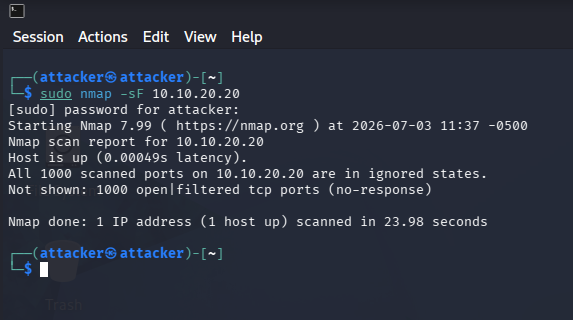
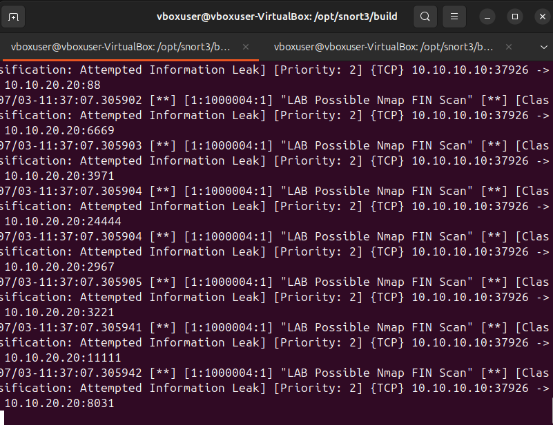
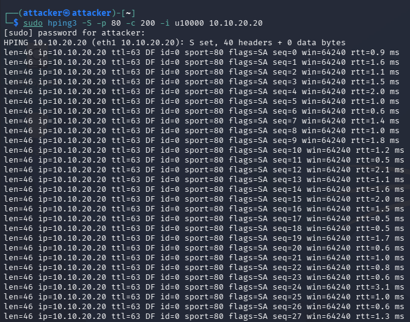

# Snort IDS Network Detection SOC Lab

## Overview

This project is a network-based SOC home lab built with **VirtualBox**, **Kali Linux**, **Ubuntu**, **Snort 3**, and a lightweight **Python/Streamlit dashboard**.

The purpose of this lab was to simulate common attacker behavior in a controlled environment, detect it with Snort IDS rules, and document the investigation like a junior SOC analyst would during alert triage.

This lab complements a host-based Wazuh project by focusing on **network-based detection**.

```text
Wazuh Lab  = Host-based detection
Snort Lab  = Network-based detection
```

## Lab Goals

- Build a routed virtual network with a Snort sensor between attacker and target systems.
- Generate network attack traffic from Kali.
- Detect reconnaissance, brute force, insecure remote access, HTTP access, and SYN-based traffic.
- Review Snort alerts from `/var/log/snort/snort.alert.fast`.
- Map detections to MITRE ATT&CK.
- Write alert investigation notes, false-positive considerations, and recommended response actions.

## Lab Architecture

```text
attacker-net: 10.10.10.0/24
target-net:   10.10.20.0/24

Kali Attacker
10.10.10.10
      |
      | attacker-net
      |
Snort IDS Sensor / Router
10.10.10.1
10.10.20.1
      |
      | target-net
      |
Ubuntu Target
10.10.20.20
```

The Snort VM was intentionally placed in the middle as a router/sensor so all Kali-to-target traffic would pass through the IDS.

## Tools Used

| Tool | Purpose |
|---|---|
| VirtualBox | Virtual lab environment |
| Kali Linux | Attacker / traffic generation |
| Ubuntu Target | Exposed services for controlled testing |
| Ubuntu Snort VM | IDS sensor and router |
| Snort 3 | Rule-based network intrusion detection |
| Nmap | Reconnaissance and scan simulation |
| Hydra | FTP brute-force simulation |
| Netcat | Controlled TCP/23 listener for Telnet-port detection |
| hping3 | Limited SYN traffic generation |
| iptables / UFW | Forwarding troubleshooting and containment |
| Python / Streamlit | Optional SOC alert dashboard |

## Attack and Detection Summary

| # | Scenario | Tool / Command | Snort Detection | MITRE Mapping |
|---|---|---|---|---|
| 1 | ICMP + TCP SYN scan | `ping`, `nmap -sS -sV` | `LAB Possible TCP SYN Scan or SYN Flood` | T1046 - Network Service Discovery |
| 2 | Nmap FIN scan | `nmap -sF` | `LAB Possible Nmap FIN Scan` | T1046 - Network Service Discovery |
| 3 | Nmap Xmas scan | `nmap -sX` | `LAB Possible Nmap Xmas Scan` | T1046 - Network Service Discovery |
| 4 | FTP brute-force attempt | `hydra` | `LAB FTP Connection Attempt` | T1110 - Brute Force |
| 5 | Telnet-port exposure | `nc` / `telnet` | `LAB Telnet Connection Attempt - Insecure Protocol` | T1021 - Remote Services |
| 6 | SSH connection attempt | `ssh` | `LAB SSH Connection Attempt` | T1021.004 - SSH |
| 7 | HTTP connection attempt | `curl` / browser / scan | `LAB HTTP Connection Attempt` | Context-dependent / service access |
| 8 | Limited SYN traffic | `hping3` | `LAB Possible TCP SYN Scan or SYN Flood` | T1498 - Network Denial of Service |

## Evidence Screenshots

### Successful Kali-to-Target Connectivity and SYN Scan


### Snort SYN Scan Alerts


### Nmap FIN Scan and Snort FIN Alerts





### Nmap Xmas Scan and Snort Xmas Alerts


### Hydra FTP Brute Force Simulation


### Telnet-Port/Insecure Protocol Detection


### SSH Detection


### HTTP Detection


### Limited SYN Traffic With hping3



## Key Findings

- Snort successfully detected multiple scan types, including SYN, FIN, and Xmas scan patterns.
- FTP brute-force traffic generated repeated Snort alerts even though Hydra did not find valid credentials.
- A controlled netcat listener on TCP/23 simulated Telnet exposure and allowed Snort to alert on insecure remote access traffic.
- SSH and HTTP connections generated service-access telemetry that could be triaged in a SOC workflow.
- Limited SYN traffic generated repeated SYN-based alerts and demonstrated how IDS signatures can overlap between reconnaissance and DoS-style behavior.
- Routing initially failed because the Snort router VM had a `FORWARD` policy of `DROP`; setting forwarding to `ACCEPT` allowed the lab traffic to pass.

## Important Troubleshooting Lesson

During the lab, Kali-to-target traffic initially failed because the Snort VM was routing traffic but the `FORWARD` chain policy was set to `DROP`. The issue was identified with:

```bash
sudo iptables -L FORWARD -n -v
```

The fix was:

```bash
sudo ufw disable
sudo iptables -F FORWARD
sudo iptables -P FORWARD ACCEPT
sudo sysctl -w net.ipv4.ip_forward=1
```

This became a valuable SOC-style troubleshooting point because it showed that detection engineering also requires understanding Linux networking and packet forwarding.

## Repository Structure

```text
Snort-IDS-Network-Detection-SOC-Lab/
├── README.md
├── architecture/
├── setup/
├── snort/
├── attacks/
├── dashboard/
├── detections/
├── response/
├── images/
└── final-report.md
```

## Portfolio Takeaway

This lab demonstrates practical SOC analyst skills:

- Network IDS deployment
- Linux routing and troubleshooting
- Custom Snort rule writing
- Alert validation
- Network reconnaissance detection
- Brute-force detection
- MITRE ATT&CK mapping
- Evidence-based investigation writeups
- Basic response and containment logic
