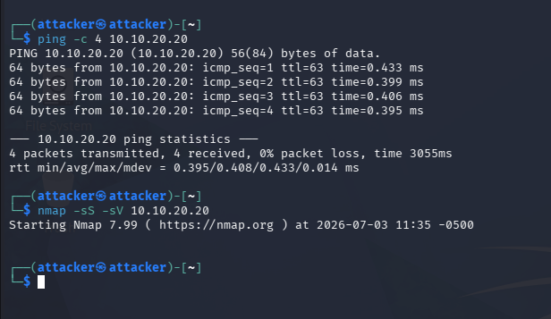
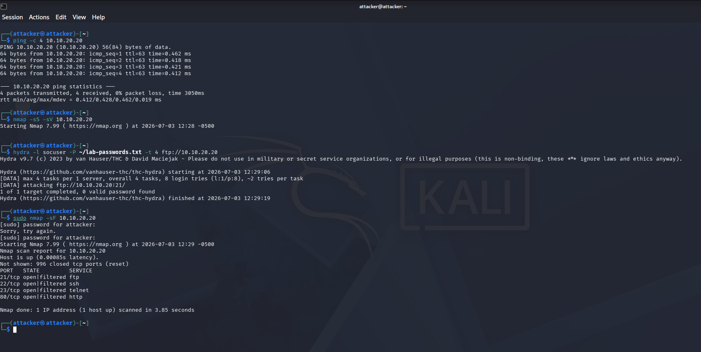
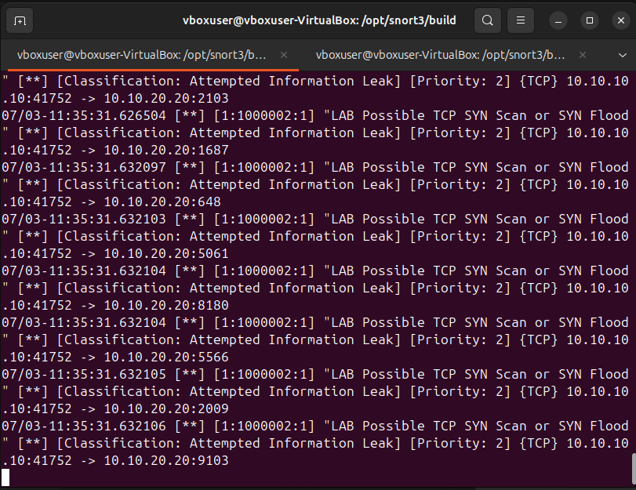

# Attack 01: ICMP Connectivity and Nmap SYN Scan

## Objective

Validate network connectivity from Kali to the target and simulate reconnaissance with a TCP SYN scan.

## Commands

```bash
ping -c 4 10.10.20.20
sudo nmap -sS -sV 10.10.20.20
```

## Evidence







## Alert Name

`LAB Possible TCP SYN Scan or SYN Flood`

## Source

`10.10.10.10`

## Destination

`10.10.20.20`

## Protocol

TCP

## Observed Behavior

The source host sent repeated SYN packets toward the target. In this lab, the traffic was generated by an Nmap SYN scan.

## Likely Cause

Authorized reconnaissance simulation from Kali Linux.

## MITRE ATT&CK Mapping

**T1046 - Network Service Discovery**

This maps to network service discovery because the activity attempts to identify open or filtered services on a remote host.

## Severity

Medium

## Why It Matters

Port scanning often occurs before exploitation. An attacker may use scan results to identify exposed services, vulnerable software, or remote access points.

## Recommended Action

- Confirm whether the scan was authorized.
- Review exposed services on the destination.
- Restrict unnecessary ports.
- Monitor for follow-up exploitation attempts.
- Correlate with authentication logs and service logs.

## False Positive Considerations

Authorized vulnerability scanners, asset inventory tools, and admin troubleshooting can generate similar traffic.
