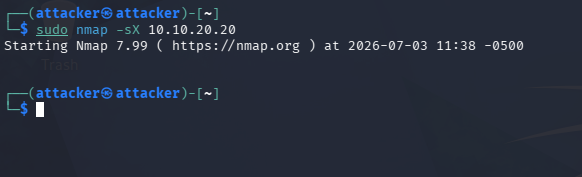
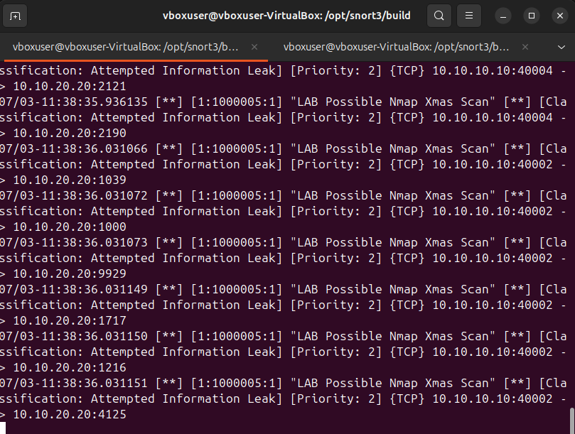

# Attack 03: Nmap Xmas Scan

## Objective

Simulate an Nmap Xmas scan and validate Snort detection of unusual TCP flag combinations.

## Command

```bash
sudo nmap -sX 10.10.20.20
```

## Evidence






## Alert Name

`LAB Possible Nmap Xmas Scan`

## Source

`10.10.10.10`

## Destination

`10.10.20.20`

## Protocol

TCP

## Observed Behavior

Snort detected TCP packets using the FIN, PSH, and URG flags.

## Likely Cause

Authorized Nmap Xmas scan from Kali.

## MITRE ATT&CK Mapping

**T1046 - Network Service Discovery**

The activity is reconnaissance-focused and attempts to identify the state of services on a remote host.

## Severity

Medium

## Why It Matters

Xmas scans are unusual in normal network traffic and are often associated with reconnaissance or testing.

## Recommended Action

- Validate whether the source host is authorized to scan.
- Correlate with firewall, NetFlow, and endpoint logs.
- Investigate any follow-up authentication or exploitation attempts.

## False Positive Considerations

Legitimate traffic rarely uses this flag combination repeatedly across many ports.
