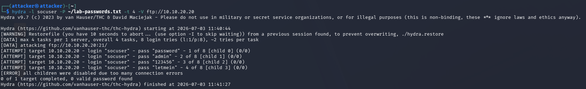
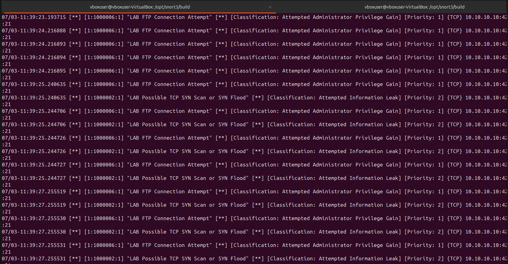

# Attack 04: FTP Brute Force Simulation

## Objective

Use Hydra to generate repeated FTP authentication attempts against the target.

## Command

```bash
hydra -l socuser -P ~/lab-passwords.txt -t 4 -V ftp://10.10.20.20
```

## Evidence






## Alert Names

- `LAB FTP Connection Attempt`
- `LAB FTP Username Submitted`
- `LAB FTP Password Submitted - Possible Brute Force`
- `LAB Possible TCP SYN Scan or SYN Flood`

## Source

`10.10.10.10`

## Destination

`10.10.20.20:21`

## Protocol

TCP / FTP

## Observed Behavior

Hydra generated multiple FTP login attempts against the target service. The run found `0 valid passwords`, but the repeated FTP connection attempts still created useful IDS telemetry.

## Likely Cause

Authorized credential attack simulation from Kali.

## MITRE ATT&CK Mapping

**T1110 - Brute Force**

This maps to brute force because the activity involved repeated credential attempts against a remote authentication service.

## Severity

High

## Why It Matters

A brute-force attempt can indicate credential access activity. A successful brute-force attack may lead to unauthorized access, lateral movement, data theft, or persistence.

## Recommended Action

- Review FTP authentication logs.
- Disable FTP if not required.
- Use SFTP/SSH-based file transfer instead of FTP.
- Enforce strong passwords.
- Enable account lockout or throttling.
- Block suspicious sources if unauthorized.
- Monitor for successful login after repeated failures.

## False Positive Considerations

Users mistyping passwords can create failed logins, but high-frequency repeated attempts from one source are more suspicious.
