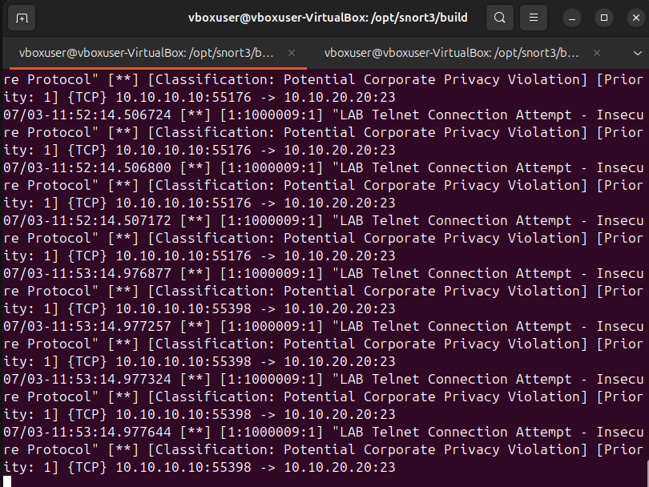

# Attack 05: Telnet-Port / Insecure Protocol Detection

## Objective

Generate TCP/23 traffic to simulate Telnet exposure and validate Snort detection of an insecure remote access port.

## Target Listener

A controlled netcat listener was used instead of a full Telnet server:

```bash
sudo nc -lk -p 23
```

## Kali Test

```bash
nc -vz -w 3 10.10.20.20 23
telnet 10.10.20.20 23
```

## Evidence




## Alert Name

`LAB Telnet Connection Attempt - Insecure Protocol`

## Source

`10.10.10.10`

## Destination

`10.10.20.20:23`

## Protocol

TCP

## Observed Behavior

Kali connected to TCP/23 on the target. Snort generated alerts for traffic to a Telnet-associated port.

## Important Lab Note

This was not a full Telnet authentication service. A controlled netcat listener was placed on TCP/23 to simulate Telnet exposure and generate network traffic for IDS validation.

Because the target used a controlled netcat listener on TCP/23 rather than a full Telnet daemon, the session did not request a username or password. The detection goal was network visibility into TCP/23 usage, not successful Telnet authentication.

## MITRE ATT&CK Mapping

**T1021 - Remote Services**

This maps to remote services because Telnet is a remote access protocol. In real environments, Telnet is especially risky because it transmits data in cleartext.

## Severity

Medium to High

## Why It Matters

Telnet should rarely be present in modern environments. Cleartext protocols can expose credentials and sensitive data.

## Recommended Action

- Disable Telnet.
- Use SSH instead.
- Block TCP/23 at firewalls.
- Monitor for repeated connection attempts.
- Investigate whether the source has a legitimate administrative purpose.

## False Positive Considerations

Legacy systems may still use Telnet for management. If Telnet is expected, restrict it to approved management networks only.
