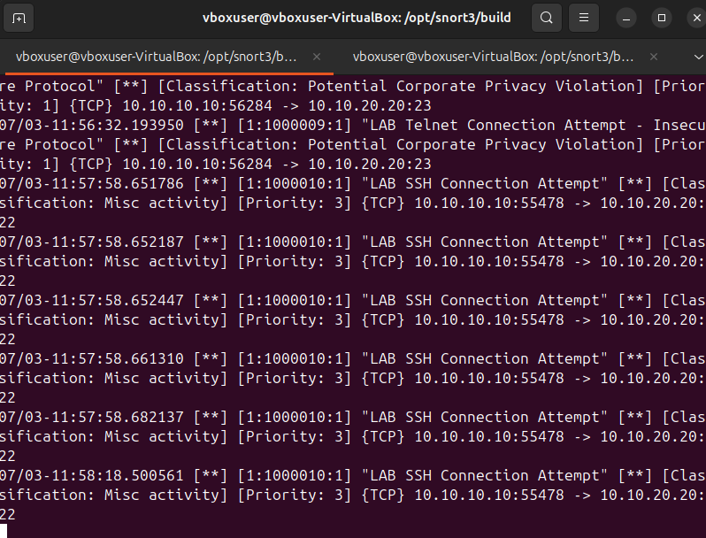
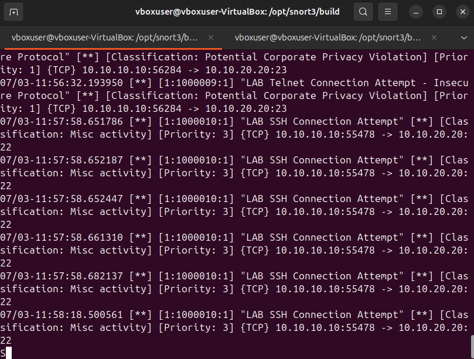
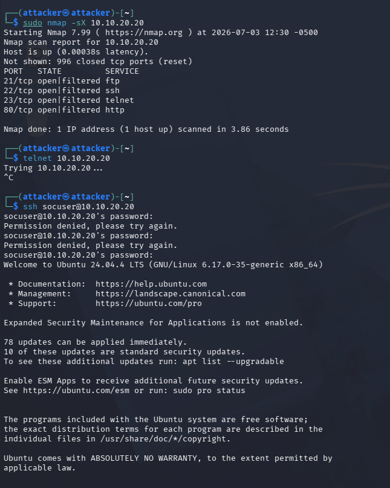

# Attack 06: SSH Connection Detection

## Objective

Generate SSH connection telemetry and confirm Snort visibility into remote service access.

## Command

```bash
ssh socuser@10.10.20.20
```

## Evidence







## Alert Name

`LAB SSH Connection Attempt`

## Source

`10.10.10.10`

## Destination

`10.10.20.20:22`

## Protocol

TCP / SSH

## Observed Behavior

Snort detected SSH connection attempts from the attacker system to the target.

## Likely Cause

Authorized SSH connection test from Kali.

## MITRE ATT&CK Mapping

**T1021.004 - Remote Services: SSH**

This maps to SSH remote services because SSH can be used for legitimate administration or malicious remote access when credentials are compromised.

## Severity

Low to Medium by itself; High if repeated, unauthorized, or paired with failed authentication logs.

## Why It Matters

SSH access attempts are common in both administrative and adversary behavior. Context determines severity.

## Recommended Action

- Review authentication logs on the target.
- Confirm whether the source IP is authorized.
- Disable password authentication where possible.
- Use SSH keys and MFA where appropriate.
- Monitor for repeated failures or successful logins after failures.

## False Positive Considerations

Normal administrative activity can trigger this detection.
