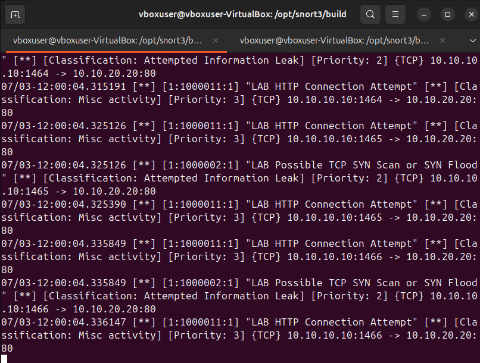

# Attack 07: HTTP Connection Detection

## Objective

Generate HTTP traffic to the target and confirm Snort can detect TCP/80 service access.

## Example Commands

```bash
curl http://10.10.20.20
nmap -sS -sV 10.10.20.20
```

## Evidence



## Alert Name

`LAB HTTP Connection Attempt`

## Source

`10.10.10.10`

## Destination

`10.10.20.20:80`

## Protocol

TCP / HTTP

## Observed Behavior

Snort detected HTTP connection attempts from Kali to the target web service.

## MITRE ATT&CK Mapping

This alert is context-dependent. Simple HTTP traffic is not malicious by itself. In this lab, it is useful as supporting telemetry around reconnaissance and service enumeration.

Possible contextual mapping:

- **T1046 - Network Service Discovery**, when HTTP traffic is part of service enumeration.
- Web attack techniques, if suspicious payloads or exploit attempts are observed.

## Severity

Low by itself; higher when correlated with scanning, brute force, exploit payloads, or unusual user-agent patterns.

## Recommended Action

- Check web server logs.
- Review requested URIs and user agents.
- Look for suspicious payloads.
- Correlate with Nmap or brute-force activity from the same source.

## False Positive Considerations

Normal browsing or monitoring tools can generate HTTP connection alerts.
